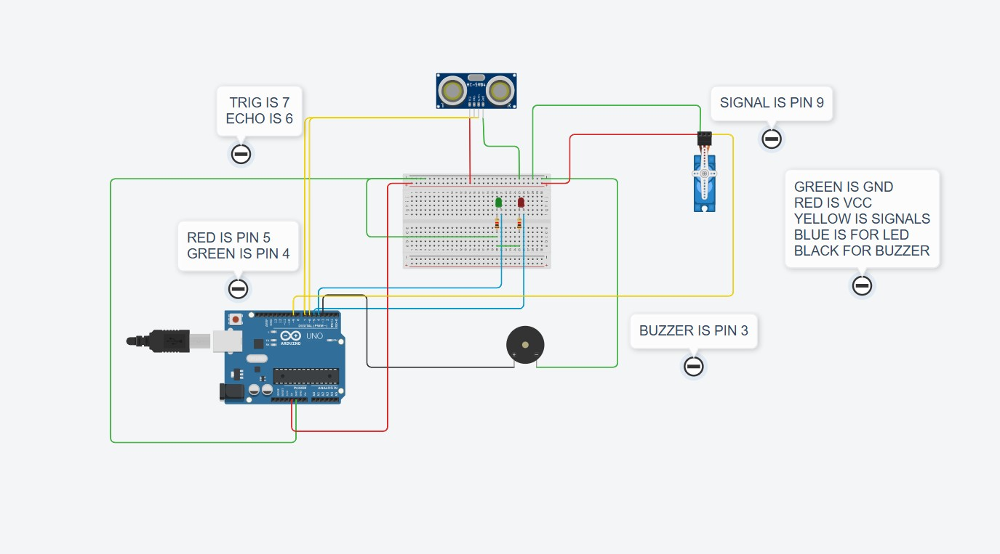

# Arduino Ultrasonic Radar Scanner

A real-time obstacle detection system built using an Arduino Uno, HC-SR04 ultrasonic sensor, and SG90 servo motor.

The servo continuously sweeps the ultrasonic sensor across an angle, allowing the system to scan its surroundings and detect objects at different positions.

 ## Features

- 📡 Real-time obstacle detection using the HC-SR04 ultrasonic sensor
- 🔄 180° servo-based radar scanning
- 🟢 Green LED indicates a safe distance
- 🔴 Red LED indicates a nearby obstacle
- 🔊 Buzzer provides audible proximity alerts
- 🖥️ Live radar visualization using Processing
  
## Components Used
- Arduino Uno
- HC-SR04 Ultrasonic Sensor
- SG90 Servo Motor
- Breadboard
- Jumper Wires
- USB Cable
- LED's
  
## Pin Connections

| Component       | Arduino Pin |
|-----------------|-------------|
| HC-SR04 Trigger | D7          | 
| HC-SR04 Echo    | D6          |
| Servo (SG90)    | D9          |
| Green LED       | D4          | 
| Red LED         | D5          | 
| Buzzer          | D3          |

## What I Learned
- Servo motor control using PWM
- Ultrasonic distance measurement
- Timing using pulseIn()
- Real-time sensor scanning
- Integrating multiple peripherals
- Debugging hardware and software together
  
## 🔌 Wiring Diagram

